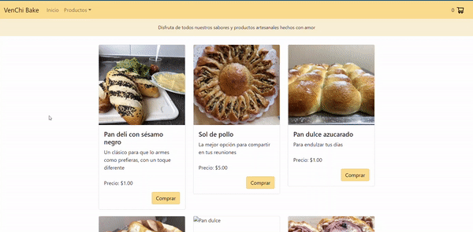
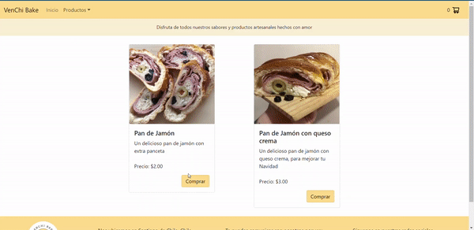

Readme
------

Lo primero a hacer para poder trabajar con este proyecto este proyecto, es asegurarse de tener node instalado

[Download | Node.js (nodejs.org)](https://nodejs.org/en/download/)

### Herramientas y Librerias

#### Create React App

Este proyecto fue creado con [Create React App](https://github.com/facebook/create-react-app), usando el comando 
```bash
npx create-react-app my-app
```
Se utiliza por su facilidad. Dado que la intención de este proyecto es enfocarse en el aprendizaje de React, era una buena opción para empezar.

#### React-Bootstrap

Varios de los componentes usados se obtuvieron de la librería [react-bootstrap](https://react-bootstrap.github.io/getting-started/introduction/).

Esta se agregó al proyecto por medio del comando 
```bash
npm install react-bootstrap bootstrap
```
¿Por qué react-bootstrap? 

Por experiencia previa con la librería, además que sólo se iban a utilizar un par de componentes nada más, no había que buscar otra librería que tuviese algún componente extra.

¿Se evaluó alguna otra librería? 

Solamenta MaterialUI, y por límites de tiempo se descartó el aprender a utilizar la librería. Además, con los componentes de bootstrap y su grid era suficiente para el objetivo de este desarrollo.

Componentes usados:
-   [NavBar](https://react-bootstrap.github.io/components/navbar/)
-   [OffCanvas](https://react-bootstrap.github.io/components/offcanvas/)
-   [Cards](https://react-bootstrap.github.io/components/cards/)
-   [Buttons](https://react-bootstrap.github.io/components/buttons/)
-   [Modal](https://react-bootstrap.github.io/components/modal/)
-   [Spinners](https://react-bootstrap.github.io/components/spinners/)

Documentación de utilidad para poder hacer el NavBar responsive, usando el Context Hook, con instrucciones provistas por Ben Honeywill: [Developing responsive layouts with React Hooks - LogRocket Blog](https://blog.logrocket.com/developing-responsive-layouts-with-react-hooks/)

#### React Router DOM

Se utiliza esta librería de routing en el proyecto para permitir la navegación en la single-page app. La documentación está disponible en [Declarative routing for React apps at any scale | React Router](https://reactrouter.com/).

Para agregarlo al proyecto se ejecuta
```bash
npm install react-router-dom@6
```

#### Firebase

La integración se hace con firebase por la facilidad de uso, la documentación e información que se encuentra con respecto a ella, y por la posibilidad de tener tanto la base de datos como el hosting ahí. También se podría hacer a futuro use de su herramienta para authentication.

Instala el cliente de firebase con
```bash
npm install firebase
```

Para el uso de la solución de base de datos Firestore, sigue los pasos en

[Primeros pasos con Cloud Firestore  |  Firebase Documentation (google.com)](https://firebase.google.com/docs/firestore/quickstart?authuser=0)

Para el uso del hosting, sigue los pasos en 

[Primeros pasos con Firebase Hosting  |  Firebase Documentation (google.com)](https://firebase.google.com/docs/hosting/quickstart?authuser=0)

Vas a necesitar el Firebase CLI
```bash
npm install -g firebase-tools
```

[Referencia de Firebase CLI  |  Firebase Documentation (google.com)](https://firebase.google.com/docs/cli?authuser=0#install_the_firebase_cli)

Luego de completar los pasos de la documentación, inicializa el proyecto con el comando
```bash
firebase init hosting
```
Para realizar implementaciones en el sitio
```bash
firebase deploy --only hosting
```

### Estructura del proyecto

El proyecto está organizado de la siguiente forma:

Se tienen dos Contexts:

**ViewPortContext.jsx**

Diseñado para identificar cuando la pantalla cambia de tamaño y almacenar esa data de ancho (width) y alto (height). Para el proyecto sólo se usa la de ancho por ahora.

**CartContext.jsx**

Donde se almacena el listado de productos (items) en un array (cart). Además, se cuenta con varias funciones de operaciones básicas sobre el carrito, como: 

-   Agregar un producto (addToCart).
-   Quitar un producto del carrito (removeFromCart).
-   Quitar todos los productos del carrito (buyAll).
-   Obtener el número total de productos en el carrito (getTotalItems).
-   Obtener el costo total del carrito (getTotalCost).
-   Obtener la cantidad de unidades de un producto (getProductAmount).
-   Verificar si un producto está en el carrito (isInCart).

Se tienen dos componentes que están presentes en todas las páginas del sitio:

**NavBar.jsx** 

Ppara el navegador. Un dato es que es el único componente que hace uso del ViewPortContext.

Si la pantalla tiene un ancho menor o igual a 575px, lo que en bootstrap es el breakpoint de "sm", entonces se muestra el la barra de navegación con un botón que hace aparecer las opciones por medio del componente Offcanvas de react-bootstrap.

En caso contrario, las opciones de navegación aparecen directamente en la parte superior y están siempre visibles.

Para facilitar la visualización y no tener un operador condicional ternario que tuviese dos opciones con muchas líneas, se crean internamente dos componentes, uno para el offcanvas llamado "OffCanvasNav" y otro para la visualización en pantallas grandes llamado "NavOptions".

En los elementos que se necesitaba hacer un link a otra "página", se utiliza el atributo as={Link} para poder setear hacía donde va el link.

Los links a las categorías se generan de forma dinámica obteniendo el listado desde Firestore dentro de este mismo componente.

Además, en la barra de navegación se puede ver el cart widget:

**CartWidget.jsx** 

Es el componente para manejar la visualización del carrito en la barra de navegación, que muestra el número de items dentro del mismo.

**Footer.jsx**

Para el footer. Viene acompañado de su propio css, Footer.module.css, con algunos estilos específicos del componente.

Después de estos componentes, viene la parte de muestra de los productos, filtrado por categorías, detalle del producto y compra.

Para todos los puntos excepto el de compra se tienen componentes con alguna variación del nombre Item. Por ende, todos se agruparon en la carpeta llamda "Items".

Entre ellos, están los componentes utilizados para mostrar el listado de productos, que pueden ser todos o sólo los productos de una categoría en específico:

**ItemListContainer.jsx** 

Maneja la lógica para decidir si mostrar la lista con todos los productos cuando se está en el inicio (o home) en el path "/", o la lista cuando se filtra por categorías en el path "category/:id".

Acá es entonces donde se hace un llamado a la base de datos en Firestore dentro el useEffect, que renderiza el componente en el mount y cada vez que se cambia el categoryId, que se obtiene con useParams de react-router-dom:

-   Si se ha navegado a alguno catergoría, se traen los productos filtrados por esa categoryId. 

-   Si no, se traen todos los producos sin filtro.

Una vez se tiene el listado, se muestra el componente de ItemList.jsx.

**ItemList.jsx** 

Es simplemente el componente que maneja la visualización de la lista de productos que se "obtiene" en el ItemListContainer.jsx.

**Item.jsx** 

Se encarga de la visualización de las cartas individuales que se muestran en la lista, para configurar cómo se ve y qué información se muestra de cada componente.



Luego, están los componentes para la vista de un producto en específico, con la información del producto y la posibilidad de agregar n cantidad de items de ese producto.

**ItemDetailContainer.jsx** 

Maneja la lógica para obtener la información del producto en específico, además de la lógica para agregar en el carrito la cantidad de items indicada por el usuario. Este componente le pasa a ItemDetail la información del item (en la variable item), la cantidad de ese producto en el carrito para mostrar un mensaje con esa cantidad (amountInCart) y la función que será llamada cuando el usuario presion el botón para agregar los items al carrito (onAdd).

**ItemDetail.jsx** 

Se encarga únicamente de la parte visual la información obtenida en ItemDetailContainer.jsx. La sección para seleccionar la cantidad de items y mostrar el botón para "Agregar al carrito" lo muestra por medio del ItemCount.jsx. En caso de que el usuario ya tenga items en el carrito de este producto, se muestra también una sección con un mensaje que especifica esa cantidad, y muestra un botón para ir al carrito directamente.

**ItemCount.jsx**

Como se mencionaba, es la sección con el contador y el botón de agregar al carrito. Hay cierta lógica en este componente, que recibe una prop llamada "stock". A partir de este valor, decide si mostrar o no del botón parar "Agregar al carrito", con la variable btnDisabled. Si no muestra este botón, en su lugar aparece un mensaje indicando que no hay stock.

También se tiene un control para que el usuario no pueda escoger más de lo que hay disponible en el stock en ese momento.

Por último, están los componentes que manejan el comportamiento y visualización del carrito, todos con "Cart" en su nombre.




**Cart.jsx** 

Muestra el nombre de los productos, la cantidad de items que se tiene por producto y un botón para eliminarlos del carrito. También se tienen los totales, tanto para la cantidad de items como el costo total del carrito.

Si no hay productos todavía en el carrito, se muestra en su lugar un mensaje indicando que no hay productos y un botón que redirige a la tienda con todos los productos disponibles, con el componente EmptyCart.jsx.


**BuyCart.jsx** 

Es el paso final de la compra, donde el usuario debe de ingresar sus datos y aceptar la compra. Para que no tenga dudas de que hay el carrito, también se incluye una lista con un resumen de la comprar.

Se tiene el botón de submit "Compra", que al ser presionado primero realiza las validaciones de los campos (nombre, teléfono y correo).

Antes de realizar las validaciones, limpia el input con la función cleanInput, para evitar recibir múltiples espacios en el texto. Luego valida:

-   Nombre
-   Verifica que el campo no esté vacío, dado que es un campo obligatorio.
-   Verifica que el nombre sea lo suficientemente "largo", es decir, que tenga al menos dos caracteres.
-   Verifica que el nombre sea lo suficientemente "corto", es decir, que tenga menos de 20 caracteres.
-   Teléfono
-   Verifica que el campo no esté vacío, dado que es un campo obligatorio.
-   Verifica que siga el formato de tres dígitos - tres dígitos - cuatro dígitos, como 123-123-1234, usando una expresión regular.
-   Una posible mejora es que el primer grupo de dígitos no sea obligatoriamente tres, sino uno o más.
-   Correo
-   Verifica que el campo no esté vacío, dado que es un campo obligatorio.
-   Verifica que el correo sea lo suficientemente "largo", es decir, que tenga al menos dos caracteres.
-   Verifica que tenga un formato correcto, es decir, al menos un caracter seguido de arroba, al menos dos caracteres, un punto, y por último al menos dos caracteres más, como puede ser a@bc.de.


Si alguna de las validaciones falla, se muestra un mensaje debajo del campo explicando qué corregir.

Si no hay nada para corregir, entonces la información de la orden se almacena en la base de datos en Firebase, y se muestra un mensaje de confirmación con el id de la orden y el listado de productos comprados, haciendo uso del componente BuyCartModal.jsx.


### Ejecutar el proyecto

Primero, una vez descargado el código fuente, hay que ejecutar
```bash
npm install
```

Para levantar el proyecto localmente, sólo hace falta ejecutar el siguiente comando
```bash
npm start
```

Para generar el build para deploys, se debe ejecutar
```bash
npm run build
```

### Automatic Deploy con GitHub Actions y Firebase

Los pasos a seguir para configurar esto correctamente en el proyecto y repositorio se encuentran en esta documentación (en inglés):

[The comprehensive guide to GitHub Actions and Firebase Hosting | by David East | Firebase Developers | Medium](https://medium.com/firebase-developers/the-comprehensive-guide-to-github-actions-and-firebase-hosting-818502d86c31)

[How to deploy a React app to Firebase using GitHub Actions (step-by-step) | by Rafael Ribeiro | Level Up Coding (gitconnected.com)](https://levelup.gitconnected.com/how-to-deploy-a-react-app-to-firebase-using-github-actions-step-by-step-11367e0627d5)

"Let's start with Workflows. Workflows are automated procedures that live in your GitHub repository. This is the configuration for specifying how the automation works and it's done with a YAML file."

En este proyecto se tiene un workflow para cuando se hace merge. Al hacer merge contra master, github automáticamente va a ejecutar ese workflow y deployará los cambios en Firebase, lo que permite ver los cambios en el enlace:

<https://venchibake.web.app/>

El archivo con el workflow es el que se encuentra en 

.github\workflows > firebase-hosting-merge.yml.

### Roadmap

- Agregar authentication con Firebase, para correo y Google.
- Mejorar la visualización en ItemDetail.jsx, para cuando se tienen más de tres imágenes. La idea sería tener un "carrousel" de las imágenes disponibles.
- Agregar mensajes de error para el usuario cuando no se logra guardar información en Firestore.
- Mejorar la estética de las opciones en la NavBar.

### Preguntas Frecuentes

Errores en el deploy automático
- [reactjs - firebase + create-react-app hosting error - Stack Overflow](https://stackoverflow.com/questions/51857516/firebase-create-react-app-hosting-error)
- [github actions - Firebase hosting build fails because process.env.ci is set to true - Stack Overflow](https://stackoverflow.com/questions/67245541/firebase-hosting-build-fails-because-process-env-ci-is-set-to-true)
